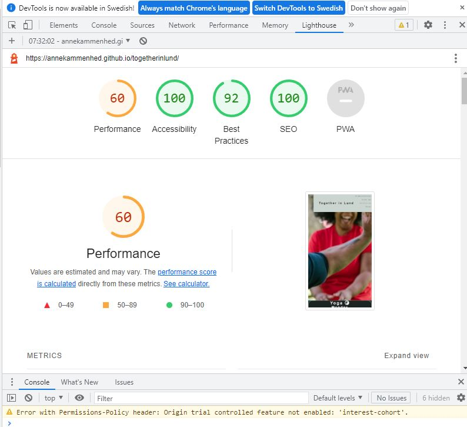
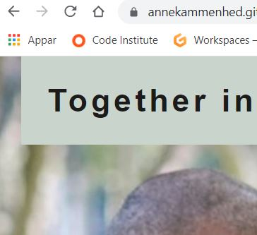
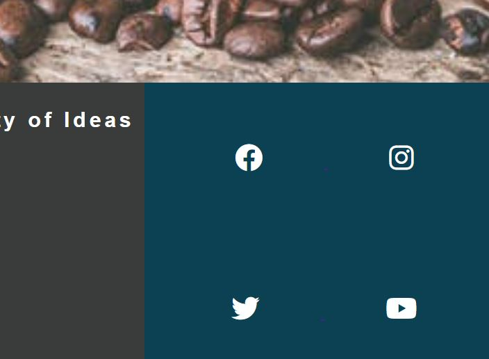

<h1>Together in Lund - Milestone Project 1</h1>

<h2>Purpose</h2>
The purpose of this website is to complete the first Milestone project for the Code Institute's Full Stack Developer course.

Together in Lund is a website for people living in Lund, Sweden who are interested in engaging in social activities. The site offers a one-stop-shop to activities in the city, organized by non gouvernemental organizations in Lund. 
_______________________

<h2>User Experience</h2>
 Users will find information about different activities on the website for example type of activity, time and a sign up form. For a first time user, it has to be easy and desireble to sign up to an activity.

The site targets people who don't usually get involved in social activities, the site aims to be a fun way to enroll in an activity.

_______________________

<h2>Features</h2>
The site contains these features

<ul>
<li>Header and navigation menu</li>
<li>Hero Image</li>
<li>Activities section</li>
<li>The sign up form</li>
<li>About the organizations and video about Lund</li>
<li>Footer with social media links</li>
</ul>

One of the features on the site that took some time to figure out was the fixed navigation in the header. Combining it with a position absolute for the form created some trouble at first, since the form went over the fixed menu. I was able to solve in with some additional code found online.

Since it is important for the users that the page functions on smaller screens, I put some effort to solve the navigation for smaller screens. The navigation goes vertical on smaller screens. 
_______________________

<h2>Testing</h2>
<h3>The tests</h3>
These are the tests that I did during the process:

<ul>
<li>I made sure that the hero image is big enough for large screens.</li>
<li>I tested the social media links and made sure they open in new tabs.</li>
<li>I tested the site on different browsers chrome, safari and explorer.</li>
<li>I tested the site on different screen sizes.</li>
<li>I tested the code in W3C HTML Validator and W3C CSS Validator (Jigsaw) a couple of times.</li>
<li>I tested the site's accessibility with Lighthouse.</li>
</ul>

<h3>Bugs</h3>
When working with the media queries, the header element shows a gap that I wasn't able to fix on screen sizes 1200px and less:

Another bug, I wasn't able to fix when working with the media queries, is that the footer element turns up on the left side of the organizations section screen sizes 1200px and less:

When looking at the social media links in explorer, there is a line under the icons that is not visible in the other tested screen-readers.

I ran the W3C HTML Validator and W3C CSS Validator (Jigsaw) a number of times and there was a couple of issued that I wasn't able to correct. For the hero image the W3C HTML Validator sais "Section lacks heading. Consider using h2-h6 elements to add identifying headings to all sections, or else use a div element instead for any cases where no heading is needed." althoug I added a div-element so the section. I tried different options for the link to youtube. The W3C HTML Validator sais that "The frameborder attribute on the iframe element is obsolete." However I was not able to fix it so the link is still in html.

The W3C CSS Validator came back with a warning about the imported fonts.
_______________________

<h2>Deployment</h2>
The site and the code is available here:

https://github.com/AnneKammenhed/togetherinlund

https://annekammenhed.github.io/togetherinlund/index.html

_______________________

<h2>Credits</h2>
The site is built with the Code Institute student template for Gitpod. 

I have gone through the different steps of the Love running project during this project and the step-by-step video instructions have really been helpful in solving some of the functions on this site. 

<ul>
<li>Fonts from https://fonts.google.com/</li>
<li>Images from https://www.pexels.com/sv-se/</li>
<li>Symbols from https://fontawesome.com/</li>
<li>Colour-palette from https://coolors.co/</li>
<li>the video links to Lunds kommun youtube page</li>
</ul>

The hero-image is taken by Rodnae productions.

I would like to thank my mentor Ronan McClelland for his gudance throughout my project.
_______________________